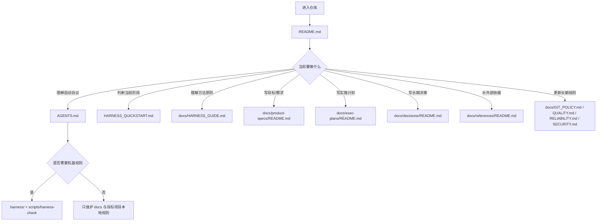

# BlacMountain harness-engineering 仓库分析报告

## 执行摘要

这个仓库已经明显从“零散规则集合”进化成了一个有入口、有路由、有局部操作说明的 harness 工程化知识库：根 `README.md` 已承担总入口与“目标项目文档落地路由”；根 `AGENTS.md` 已承担启动协议与“Target Harness Transfer”；`docs/product-specs`、`docs/exec-plans`、`docs/decisions`、`docs/references` 各自都已有本地 `README.md` 解释“什么时候写、写什么、不写什么、怎么用”；`docs/GIT_POLICY.md` 也已明确把 `.harness/git-policy.yaml` 视作机器可读规则，把文档视作人工判断解释层。fileciteturn34file0L9-L23 fileciteturn34file0L25-L48 fileciteturn35file0L8-L18 fileciteturn35file0L30-L39 fileciteturn36file0L7-L31 fileciteturn37file0L7-L39 fileciteturn38file0L7-L25 fileciteturn39file0L7-L25 fileciteturn40file0L8-L28

当前最大的结构性问题，不再是“docs 不知道怎么写”，而是“世界观还未完全收敛”：一条线是旧的 `project type / templates/<project-type>/` 初始化思路；另一条线是你现在真正想要的一条统一方法线——让 Agent 进入仓库后学习一套通用项目周期管理方法，再把这套方法应用到目标项目。你上传的两份重整计划也都在围绕这个问题收敛，只是第一份方案还保留了 `DOCS_STRUCTURE.md` 和模板分层，第二份则已经明确主张删除 `DOCS_STRUCTURE.md`、把总路由收敛到根 `README.md`、把具体写法下沉到目录本地 `README.md`。fileciteturn0file0 fileciteturn0file1

因此，我的核心结论有三点。第一，这个仓库现在已经足够接近“Agent 项目周期管理 OS”，不需要再增加新的大文档，而是要继续削减重复和世界观分叉。第二，`project type` 相关内容应整体退场，`HARNESS_QUICKSTART.md` 应改写为“工作阶段与文档动作决策树”，而不是“模板/类型选择器”。第三，`.harness/` 只有在它真的是**机器可读 contract**、并被 `scripts/harness-check` 或其他自动化真实消费时才值得保留；如果只是第二套 prose 的镜像，它会成为新的重复源。这个判断与 OpenAI 在 2026 年对 harness engineering 的公开经验是一致的：`AGENTS.md` 应是短地图，`docs/` 是 system of record，执行计划是一等工件，结构应支持 progressive disclosure，而不是把所有规则堆成一个巨型说明书。fileciteturn35file0L30-L39 fileciteturn40file0L8-L28 citeturn35search2turn13search1

## 当前仓库可验证盘点

先说明证据边界。本报告中的仓库盘点，分为两层：一层是**直接可核验**的当前仓库文件片段——这些来自你在本次对话先前已经读取过的文件引用，包括根 `README.md`、根 `AGENTS.md`、四个 docs 子目录本地 `README.md`、以及 `GIT_POLICY.md / QUALITY.md / RELIABILITY.md / SECURITY.md`；另一层是**高置信推断**——这些来自你上传的两份仓库重整计划，它们明确点名了 `HARNESS_QUICKSTART.md`、`docs/HARNESS_GUIDE.md`、`.harness/project-policy.yaml`、`scripts/harness-check`、`templates/<project-type>/` 等路径与职责。由于当前浏览层没有直接展开该仓库树页，以下“全量清单”以“直接核验 + 高置信推断”的方式给出，并在表中标注。fileciteturn34file0L9-L23 fileciteturn35file0L8-L18 fileciteturn0file0 fileciteturn0file1

下表是根层级可见项。

| 路径 | 类型 | 作用推断 | 行数/大小 | 证据与置信度 |
|---|---|---|---|---|
| `README.md` | 文件 | 根入口；说明仓库能力边界、初始化流程、目标项目文档落地路由 | 至少可见到第 48 行 | 直接核验，高；`README` 已承担“功能边界 + 初始化 + 文档落地路由” fileciteturn34file0L9-L23 fileciteturn34file0L25-L48 |
| `AGENTS.md` | 文件 | 启动协议；说明 seed repo 下 Agent 应如何进入、判断、并把 durable rules 转移到目标项目 | 至少可见到第 39 行 | 直接核验，高；含 Startup Protocol 与 `Target Harness Transfer` fileciteturn35file0L8-L18 fileciteturn35file0L30-L39 |
| `HARNESS_QUICKSTART.md` | 文件 | 快速决策/判断路径；当前仍带有初始化决策树意味，后续应改成“工作阶段与文档动作”决策树 | 行数不可直接得 | 高置信推断；两份计划都把它视为初始化/决策入口之一 fileciteturn0file0 fileciteturn0file1 |
| `docs/` | 目录 | 项目周期管理知识库；system-of-record | 目录 | 直接核验 + 外部基准；当前 README 已把文档落地路由指向 `docs/*`，也符合 OpenAI 的 docs-as-system-of-record 思路 fileciteturn34file0L25-L48 citeturn35search2 |
| `.harness/` | 目录 | 机器可读 policy 层；用于 durable rules、脚本校验或目标项目 transfer | 目录 | 直接核验 + 高置信推断；`AGENTS` 与 `GIT_POLICY` 都给了它机器规则定位 fileciteturn35file0L30-L39 fileciteturn40file0L8-L28 |
| `scripts/` | 目录 | 结构与规约校验；核心项是 `scripts/harness-check` | 目录 | 高置信推断；两份计划都明确提到 `scripts/harness-check` 要同步更新 fileciteturn0file0 fileciteturn0file1 |
| `templates/` | 目录 | 历史上用于 `project-type` 模板分叉的 bootstrap 目录；现在与你想要的“统一方法仓库”方向冲突 | 目录 | 高置信推断；计划明确讨论 `templates/<project-type>/` 的保留或不动逻辑 fileciteturn0file0 fileciteturn0file1 |

下表是当前可见的 `docs/*` 结构。

| 路径 | 类型 | 作用推断 | 行数/大小 | 证据与置信度 |
|---|---|---|---|---|
| `docs/HARNESS_GUIDE.md` | 文件 | 方法层说明文档；更适合回答“为什么这样设计”，不适合再承担目录路由 | 行数不可直接得 | 高置信推断；计划指出它当时主要解释 docs 应该存在、放什么，但缺少逐目录操作说明 fileciteturn0file0 |
| `docs/GIT_POLICY.md` | 文件 | Git 边界与 artifact/version-control policy；并明确与 `.harness/git-policy.yaml`、`.gitignore` 的关系 | 至少可见到第 28 行 | 直接核验，高 fileciteturn40file0L8-L28 |
| `docs/QUALITY.md` | 文件 | 质量基线、验证命令、门槛与更新条件 | 至少可见到第 20 行 | 直接核验，高 fileciteturn31file0L7-L20 |
| `docs/RELIABILITY.md` | 文件 | 超时、重试、回滚、故障模式、观测与恢复等长期规则 | 至少可见到第 20 行 | 直接核验，高 fileciteturn32file0L7-L20 |
| `docs/SECURITY.md` | 文件 | secret、权限、信任边界、认证与外部访问规则 | 至少可见到第 20 行 | 直接核验，高 fileciteturn33file0L7-L20 |
| `docs/product-specs/` | 目录 | 目标/需求/验收基准的存放位置 | 目录 | 直接核验，高；根 README 已把“写系统应该是什么”路由到这里 fileciteturn34file0L25-L48 |
| `docs/product-specs/README.md` | 文件 | 说明何时写 spec、写什么、不写什么、怎么验证 | 至少可见到第 31 行 | 直接核验，高 fileciteturn36file0L7-L31 |
| `docs/exec-plans/` | 目录 | 活跃计划、完成归档、技术债/计划分类 | 目录 | 直接核验，高；根 README 已把“写本次任务怎么做 / 完成后归档”路由到这里 fileciteturn34file0L25-L48 |
| `docs/exec-plans/README.md` | 文件 | 说明 active/completed/tech-debt 结构、何时创建与迁移 | 至少可见到第 39 行 | 直接核验，高 fileciteturn37file0L7-L39 |
| `docs/decisions/` | 目录 | ADR/长期决策记录 | 目录 | 直接核验，高；根 README 已把“写为什么这样决策”路由到这里 fileciteturn34file0L25-L48 |
| `docs/decisions/README.md` | 文件 | ADR 触发条件与必填字段说明 | 至少可见到第 25 行 | 直接核验，高 fileciteturn39file0L7-L25 |
| `docs/references/` | 目录 | 外部依据、API、论文、协议、平台约束等参考材料 | 目录 | 直接核验，高；根 README 已把“写外部依据”路由到这里 fileciteturn34file0L25-L48 |
| `docs/references/README.md` | 文件 | 说明何时记录外部依据、记录字段与适用范围 | 至少可见到第 25 行 | 直接核验，高 fileciteturn38file0L7-L25 |

还有两类历史项需要单独说明。其一，`docs/DOCS_STRUCTURE.md` 在你上传的第二份方案里已被明确判定为与根 `README.md` 重复，主张删除，并把有效内容拆到根 `README.md` 与各目录本地 `README.md`。其二，`docs/PROJECT_TYPES.md` 与 `templates/<project-type>/` 代表的是旧的“按类型选 harness”世界观；这条线在你当前目标下更像“待消除的历史负担”，不应再继续扩充。fileciteturn0file1

## 逐项运维说明

下面按你指定的对象，逐项说明“目的、触发时机、必填字段/模板、禁止内容、如何验证/使用”。为了控制篇幅，每个对象使用同一张五行分析表。

**`README.md`**

| 维度 | 说明 |
|---|---|
| 目的 | 作为单一顶层入口，回答“这个仓库是干什么的、先读什么、不同任务去哪里写”。 |
| 触发时机 | 任何 Agent 首次进入仓库时必须先读；只要路由关系、目录职责、目标项目文档落点变化，就要更新。 |
| 必填字段/模板 | 仓库用途；阅读顺序；文档落地路由；与 `AGENTS.md`、`HARNESS_QUICKSTART.md`、各目录本地 `README.md` 的关系。 |
| 禁止内容 | 不应复制所有目录的详细写法；不应把 policy 规则全文再抄一遍。 |
| 验证/使用 | 新 Agent 应能在 30 秒内回答：这个仓库的用途、下一步看哪份文档、spec/plan/ADR/reference 分别写到哪里。 |

依据是当前 `README.md` 已经同时承担“仓库边界说明”和“目标项目文档落地路由”两项职责。fileciteturn34file0L9-L23 fileciteturn34file0L25-L48

**`AGENTS.md`**

| 维度 | 说明 |
|---|---|
| 目的 | 作为 Agent 的操作协议文件，规定进入仓库后的第一动作与 durable rules 的转移方式。 |
| 触发时机 | 每次进入仓库先读；当启动流程、目标项目转移方式、durable rules 存放位置变化时更新。 |
| 必填字段/模板 | Startup Protocol；Target Harness Transfer；文档维护约束；完成报告的文档同步要求。 |
| 禁止内容 | 不应变成大而全手册；不应复制各目录 README 的写法教程。 |
| 验证/使用 | Agent 应能依据它完成“先读什么、何时把规则写进 `.harness/*.yaml`、何时回写 docs”。 |

当前 `AGENTS.md` 已经明确要求目标项目初始化时复制或生成本地 `AGENTS.md`、`.harness/`、docs 和 checks，并先把 durable rules 写入 `.harness/*.yaml`。fileciteturn35file0L8-L18 fileciteturn35file0L30-L39

**`HARNESS_QUICKSTART.md`**

| 维度 | 说明 |
|---|---|
| 目的 | 快速判断当前工作阶段，并决定下一步应创建/读取哪类工件。 |
| 触发时机 | 读完根 `README.md` 与 `AGENTS.md` 后立即使用；当工作阶段模型变化时更新。 |
| 必填字段/模板 | 当前阶段识别；下一步动作；需要创建或检查的文档；是否进入 policy 文档或 `.harness/`。 |
| 禁止内容 | 在你当前目标下，不应再承担 project-type/template selector 的角色。 |
| 验证/使用 | 对“新需求、复杂实现、长期决策、外部参考、规则变更”五类场景，应能稳定导向正确文档。 |

这份文件在两份计划中都被视为快速决策入口，但你现在的方向已经不是“选择模板”，而是“选择当前任务需要的文档动作”。fileciteturn0file0 fileciteturn0file1

**`docs/product-specs/`**

| 维度 | 说明 |
|---|---|
| 目的 | 记录“系统应该是什么”，即目标、用户、需求、输入输出与验收标准。 |
| 触发时机 | 新项目启动；新功能引入；目标、用户行为、输入输出、验收标准变化时更新。 |
| 必填字段/模板 | 目标；用户；核心需求；输入/输出；验收标准。 |
| 禁止内容 | 不应写实施步骤、任务拆解、执行顺序、临时开发细节。 |
| 验证/使用 | 实现工作开始前，spec 应能被用来判断 done / not done；计划与实现不得与 spec 冲突。 |

当前本地 `README.md` 已清楚区分了 product spec 与 implementation plan 的边界。fileciteturn36file0L7-L31

**`docs/exec-plans/`**

| 维度 | 说明 |
|---|---|
| 目的 | 记录“这次任务怎么做”，并把活跃计划、完成计划、技术债区分存放。 |
| 触发时机 | 非平凡实现开始前创建；执行中更新；完成后迁移到 `completed/`；长期未做但应追踪的项进入 tech debt。 |
| 必填字段/模板 | 背景；目标/非目标；任务步骤；风险；验证方式；完成后的归档去向。 |
| 禁止内容 | 不应把长期产品目标写成任务步骤；不应把架构原则只放在计划里而不回写决策/架构文档。 |
| 验证/使用 | `active/` 只放进行中的计划；完成项必须迁移；技术债不得伪装成活跃计划。 |

当前本地 `README.md` 已经把 `active / completed / tech-debt` 的目录职责与迁移规则说清楚。fileciteturn37file0L7-L39

**`docs/decisions/`**

| 维度 | 说明 |
|---|---|
| 目的 | 记录长期有效、可复述、会影响后续工作的技术或治理决策。 |
| 触发时机 | 数据库、框架、协议、部署模型、核心依赖、约束边界等 durable choices 发生时创建。 |
| 必填字段/模板 | 背景；决策；原因；影响/后果；如有必要，补 alternatives considered。 |
| 禁止内容 | 变量改名、一次性修 bug、任务步骤类细节，不应升级成 ADR。 |
| 验证/使用 | 当后来的人问“为什么这样做”时，应能直接在此处回答；架构/策略变化应有可追溯 ADR。 |

当前本地 `README.md` 已把它定位为“长期决策记录”而非普通开发日志。fileciteturn39file0L7-L25

**`docs/references/`**

| 维度 | 说明 |
|---|---|
| 目的 | 存外部依据：API 文档、论文、协议说明、SDK 行为、平台限制等。 |
| 触发时机 | 一旦实现依赖外部事实、第三方文档或平台约束，就应补充；外部事实变化时更新。 |
| 必填字段/模板 | `Source`、`Date`、`Summary`、`Applies to`。 |
| 禁止内容 | 不应把内部决策和外部依据混写在一起；不应只贴链接不写适用范围。 |
| 验证/使用 | 任何带外部依赖的实现，都应能追溯其依据；更新依赖时应复核 reference。 |

当前本地 `README.md` 已明确要求至少记录来源、日期、摘要和适用范围。fileciteturn38file0L7-L25

**`docs/GIT_POLICY.md`**

| 维度 | 说明 |
|---|---|
| 目的 | 定义什么应该进 Git、什么不该进 Git，以及这类规则如何落到 `.gitignore` 与 `.harness/git-policy.yaml`。 |
| 触发时机 | 仓库边界、artifact 规则、禁提路径、提交边界变化时更新。 |
| 必填字段/模板 | 什么时候读；什么时候更新；规则关系；与 `.gitignore`、`.harness/git-policy.yaml` 的分工。 |
| 禁止内容 | 不应写临时开发步骤；不应只给笼统口号而没有具体边界。 |
| 验证/使用 | 如果保留 `.harness/`，脚本必须能读机器规则；文档则负责解释人工判断与灰区。 |

当前 `GIT_POLICY.md` 已明确采用三层表示：机器可读 YAML、本地 `.gitignore`、人工解释文档。fileciteturn40file0L8-L28

**`docs/QUALITY.md`**

| 维度 | 说明 |
|---|---|
| 目的 | 定义测试、lint、coverage、review、验收等质量门槛。 |
| 触发时机 | 项目初始化；验证命令变化；质量门槛变化；新增验收维度时更新。 |
| 必填字段/模板 | 什么时候读；什么时候更新；验证命令；最低质量门槛。 |
| 禁止内容 | 不应混入任务步骤；不应把某次 PR 的局部要求当作长期普适规则。 |
| 验证/使用 | Agent 完成任务时，应用它确认是否达到可提交/可交付状态。 |

当前文件已经具备“什么时候读 / 什么时候更新”的使用说明。fileciteturn31file0L7-L20

**`docs/RELIABILITY.md`**

| 维度 | 说明 |
|---|---|
| 目的 | 定义故障模式、超时、重试、回滚、备份、观测性与恢复要求。 |
| 触发时机 | 初始化时创建；出现新故障模式、恢复策略变化、SLO/SLA 边界变化时更新。 |
| 必填字段/模板 | 什么时候读；什么时候更新；关键 failure class；恢复与观测要求。 |
| 禁止内容 | 不应把纯功能需求写进可靠性文档；不应只写理念不写可执行约束。 |
| 验证/使用 | 新功能如果改变失败行为、重试、rollback 或监控，需要回写这里。 |

当前文件也已具备显式的读/更时机说明。fileciteturn32file0L7-L20

**`docs/SECURITY.md`**

| 维度 | 说明 |
|---|---|
| 目的 | 定义 secrets、权限、认证、信任边界、敏感数据与外部执行风险。 |
| 触发时机 | 初始化时创建；新增认证机制、第三方接口、敏感数据、secret 流程时更新。 |
| 必填字段/模板 | 什么时候读；什么时候更新；secret handling；权限/边界；敏感数据处理要求。 |
| 禁止内容 | 不应把部署命令或一次性修复步骤写成安全文档；不应停留在空洞口号。 |
| 验证/使用 | 涉及 credentials、auth、external access、trust boundary 的任务必须先读、后更新。 |

当前文件也具备读/更时机说明。fileciteturn33file0L7-L20

**`docs/HARNESS_GUIDE.md`**

| 维度 | 说明 |
|---|---|
| 目的 | 解释方法论本身：为什么需要 repo-local docs、为什么 AGENTS 要短、为什么 progressive disclosure。 |
| 触发时机 | 读完入口后，若需要理解设计原则或统一概念边界时再读；方法层变化时更新。 |
| 必填字段/模板 | repo as system of record；map not manual；artifact classes；doc-code sync invariant；rules vs automation。 |
| 禁止内容 | 不应再承担目录地图；更不应与目录本地 `README.md` 重复“怎么写”。 |
| 验证/使用 | 读完后应能回答“为什么这样组织”，而不是“这个文件夹里写什么”。 |

你上传的计划明确指出，`HARNESS_GUIDE.md` 如果只解释 docs 应该存在、概略放什么，就会和后来的本地目录 `README.md` 功能重叠。fileciteturn0file0

**`.harness/`**

| 维度 | 说明 |
|---|---|
| 目的 | 机器可读 contract 层，保存脚本和自动化必须确定读取的 durable rules。 |
| 触发时机 | 只有在某规则需要被脚本/Agent 稳定解析并执行时才创建或更新。 |
| 必填字段/模板 | 若保留，建议仅保留 `required_files`、`forbidden_paths`、`validation_commands`、`policy_locations` 这类机器字段。 |
| 禁止内容 | 禁止成为 Markdown 文档的 YAML 镜像；禁止存放没人消费的“伪结构化”配置。 |
| 验证/使用 | `scripts/harness-check` 必须真实读取它；若没有任何自动化读取，就应删除。 |

这是你当前最值得拍板的一点。当前仓库已经把 `.harness/*.yaml` 定位为 durable rules 的机器表示层；如果你要保留它，就必须让脚本消费它。否则它将成为第二套说明书。fileciteturn35file0L30-L39 fileciteturn40file0L8-L28

**`scripts/`**

| 维度 | 说明 |
|---|---|
| 目的 | 提供结构与规则校验脚本，最核心的是 `scripts/harness-check`。 |
| 触发时机 | 新增/删除必需目录、本地目录 README、policy doc、`.harness` 字段时更新。 |
| 必填字段/模板 | 明确检查项、失败提示、退出码；最好把 required files 和 policy expectations 外置到数据文件。 |
| 禁止内容 | 禁止仍校验旧的 `project type / templates` 分叉；禁止隐式依赖未文档化的路径。 |
| 验证/使用 | 本地可跑，CI 可跑；规则变化之后应先更新脚本再更新文档。 |

两份计划都把 `scripts/harness-check` 视为结构性收敛的最后落点。fileciteturn0file0 fileciteturn0file1

## 重复、冗余与潜在冲突

下面不是泛泛而谈，而是按“重复源 / 冲突点 / 影响 / 建议”来列。

| 类型 | 路径与段落 | 证据 | 影响 | 建议 |
|---|---|---|---|---|
| 已解决但应防回流的历史重复 | `README.md` 的 docs 路由 vs 旧 `docs/DOCS_STRUCTURE.md` | 你上传的第二份方案明确指出 `docs/DOCS_STRUCTURE.md` 与根 `README.md` 都在做“总地图”，应删除前者，把有效内容拆到 README 与各目录本地 README。fileciteturn0file1 | 如果回流，会再次出现“地图有三份版本”的问题。 | 保持删除状态，不再恢复。 |
| 当前仍需克制的路由重叠 | `README.md` 的“目标项目文档落地路由” vs `AGENTS.md` 的启动与 transfer 说明 | README 负责“去哪”，AGENTS 负责“先做什么、durable rules 落哪儿”。两者存在必要交叉，但不应互抄。fileciteturn34file0L25-L48 fileciteturn35file0L8-L18 fileciteturn35file0L30-L39 | 若 AGENTS 开始重复 README 路由，后续会漂移。 | AGENTS 只保留 imperative rules；README 保留完整总地图。 |
| 方法层与操作层重叠 | `docs/HARNESS_GUIDE.md` vs `docs/product-specs/README.md`、`docs/exec-plans/README.md`、`docs/decisions/README.md`、`docs/references/README.md` | 第一份方案指出 HARNESS_GUIDE 只解释 docs 应该存在与大类用途，不足以承担具体写法；而当前这四个目录 README 已承担具体操作说明。fileciteturn0file0 fileciteturn36file0L7-L31 fileciteturn37file0L7-L39 fileciteturn38file0L7-L25 fileciteturn39file0L7-L25 | 若 HARNESS_GUIDE 仍重复“什么时候写 spec/plan/ADR/reference”，会与目录 README 打架。 | 让 HARNESS_GUIDE 只讲原则，不再讲逐目录写法。 |
| 有意的双表示，但有失控风险 | `.harness/git-policy.yaml` vs `docs/GIT_POLICY.md` | 当前 `GIT_POLICY.md` 已经清楚说明 YAML 负责 machine-readable rules，文档解释人工判断。fileciteturn40file0L8-L28 | 若 YAML 没有被脚本消费，就会沦为无价值复制。 | 保留双表示的前提是脚本真解析 YAML；否则删除 `.harness/`。 |
| 当前最大概念分叉 | `HARNESS_QUICKSTART.md`、`docs/PROJECT_TYPES.md`、`templates/` 与你现在想要的“统一方法仓库” | 两份方案都仍保留了 project-type/template 视角，只是第二份开始大幅收敛；而你当前明确要“去掉根据不同类型选择不同 harness 部署方案”。fileciteturn0file0 fileciteturn0file1 | 仓库会同时讲两套故事：一套是模板部署，一套是方法学习。 | 明确选后一套，并一次性删除 type/template 叙事。 |

如果只用一句话概括：现在仓库的“文档操作问题”基本已经解决，但“统一方法仓库 vs 多模板 seed 仓库”的顶层叙事还没有完全收口。OpenAI 的公开经验同样强调，真正稳健的做法是让 `AGENTS.md` 做短地图，让 `docs/` 作为 system of record，再用机械校验保证一致性，而不是持续增加新的入口文件和模板分支。citeturn35search2

## 顶层入口 README 草案与局部 README 模板

你想要的不是“再解释我是什么”，而是“直接告诉 Agent 该怎么做”。下面这份顶层 README 草案，按这个目标写。

```md
# harness-engineering

本仓库定义一套统一的 harness 工程化项目管理方案。
Agent 进入仓库后，应学习这套方法，并将其应用到目标项目。
本仓库不是 project-type 模板仓库；它的重点是统一的文档生命周期、规则落点和项目推进方式。

## 先读什么

1. `AGENTS.md`
   - 启动协议：进入仓库后先做什么。
   - durable rules 应放到哪里。
2. `HARNESS_QUICKSTART.md`
   - 判断当前任务处于什么阶段。
   - 决定下一步该创建或更新哪类文档。
3. `docs/HARNESS_GUIDE.md`
   - 理解为什么这样组织：repo-as-record、map-not-manual、progressive disclosure。
4. 按任务进入对应位置：
   - 需求/目标：`docs/product-specs/README.md`
   - 实施计划：`docs/exec-plans/README.md`
   - 长期决策：`docs/decisions/README.md`
   - 外部依据：`docs/references/README.md`
   - 长期规则：`docs/GIT_POLICY.md` `docs/QUALITY.md` `docs/RELIABILITY.md` `docs/SECURITY.md`
5. 如启用机器校验：
   - 查看 `.harness/`
   - 运行 `scripts/harness-check`

## 工作原则

- 代码、文档、规则必须描述同一系统状态。
- 行为、架构、验证方式、Git 边界、安全边界、可靠性假设发生变化时，同步更新对应文档。
- 如果判定某次变更不需要更新文档，在完成报告中解释原因。
```

这份草案与当前仓库已经形成的分工是一致的：根 README 做总路由，根 AGENTS 做操作协议，目录本地 README 做局部写法，policy docs 管长期规则。fileciteturn34file0L25-L48 fileciteturn35file0L8-L18 fileciteturn35file0L30-L39

对应的“葡萄串”式阅读/决策流，可以直接写进 README：



下面是一段式的局部 `README` 模板。它们的设计原则是：每个目录只回答本目录的事，不再重复整个仓库的地图。

**`docs/product-specs/README.md` 一段式模板**

> 本目录用于记录“系统应该是什么”，即目标、用户、约束、核心需求、输入输出与验收标准。收到新需求、定义新功能、或验收条件发生变化时，应在这里创建或更新文档。每份 spec 必须包含 Goal、Users、Requirements、Inputs/Outputs、Acceptance Criteria。这里不写实施步骤、不写任务拆解、不写临时代码计划；实现如何完成，交给 `docs/exec-plans/`。

**`docs/exec-plans/README.md` 一段式模板**

> 本目录用于记录“这次任务怎么做”。非平凡实现开始前，在 `active/` 创建计划；执行中持续更新；完成后移至 `completed/`；尚未执行但需要追踪的长期问题放入 tech debt。每份计划至少包含 Background、Goal、Non-goals、Steps、Risks、Validation。这里不替代 spec，也不替代 ADR；它服务于一次执行周期，而不是长期真相源。

**`docs/decisions/README.md` 一段式模板**

> 本目录用于记录长期有效的技术或治理决策。凡是会影响后续实现、迁移、运营或规则的 durable choice——如数据库、框架、协议、部署模型、目录契约——都应写 ADR。每份 ADR 至少包含 Context、Decision、Rationale、Consequences。这里不记录一次性修 bug 的过程，也不写开发任务拆解。

**`docs/references/README.md` 一段式模板**

> 本目录用于记录外部依据：第三方 API 文档、论文、协议、平台限制、SDK 行为、法律或合规要求。只要某项实现依赖外部事实，就应在这里落一份 reference。每份记录至少包含 Source、Date、Summary、Applies to。不要只贴链接；要说明这条依据影响哪些实现或规则。

**`docs/GIT_POLICY.md` 一段式模板**

> 需要判断什么该进 Git、什么不该进 Git、哪些路径禁止提交、artifact 如何处理时，先读本文件。仓库边界、生成物边界、忽略规则或提交策略变化时更新本文件；如果同时保留 `.harness/git-policy.yaml`，则 YAML 存机器规则，本文件解释人工判断与灰区。

**`docs/QUALITY.md` 一段式模板**

> 需要判断交付质量、验证命令、测试/静态检查/coverage 门槛时，先读本文件。凡是测试命令、门槛、review 要求、done 定义变化时更新本文件；任务完成前必须用它校验结果是否达到可提交状态。

**`docs/RELIABILITY.md` 一段式模板**

> 需要处理超时、重试、回滚、故障边界、备份恢复、观测性要求时，先读本文件。只要新增 failure mode、恢复策略、SLO/SLA 假设或运维边界，就更新本文件；功能变更如果改变失败行为，必须同步回写这里。

**`docs/SECURITY.md` 一段式模板**

> 需要处理 secrets、权限、认证、敏感数据、trust boundary 或外部访问规则时，先读本文件。新增 secret 流程、auth 模型、第三方访问、数据分类或权限边界时更新本文件；所有涉及安全边界的改动都必须把这里当作长期真相源。

这些模板不是凭空拍脑袋得出的，而是顺着你当前仓库已经建立好的本地 README/policy 文档职责继续收敛：当前四个 docs 子目录 README 已经说明了用途、何时写、必填内容和禁止内容；四个 policy 文档也已经开始说明“什么时候读 / 什么时候更新”。fileciteturn36file0L7-L31 fileciteturn37file0L7-L39 fileciteturn38file0L7-L25 fileciteturn39file0L7-L25 fileciteturn31file0L7-L20 fileciteturn32file0L7-L20 fileciteturn33file0L7-L20 fileciteturn40file0L8-L28

## 结构性改造建议

先直接回答你最关心的问题：`.harness/` 到底有什么用。

`.harness/` 的唯一充分用途，是把那些**必须被机器稳定解析、检查和执行的 durable rules**，从 prose 中抽成明确的结构化 contract。当前仓库里，这一点其实已经被写得很清楚：`AGENTS.md` 说 durable rules 应先放进目标项目的 `.harness/*.yaml`，再由 docs 解释；`GIT_POLICY.md` 又明确说 `.harness/git-policy.yaml` 是 machine-readable rules，而 `.gitignore` 与文档分别承担本地忽略边界和人工判断解释。也就是说，`.harness/` 不是给人读的第二套说明书，而是给脚本、自动化和目标项目转移流程读的 deterministic input。fileciteturn35file0L30-L39 fileciteturn40file0L8-L28

但反过来说，如果这个仓库未来不再承担“模板部署”和“自动下沉到目标项目”的职责，而只是一个**定义统一 harness 方法的知识仓库**，那么 `.harness/` 只有在两个条件同时成立时才值得保留：第一，`scripts/harness-check` 或其他自动化真的解析它；第二，它只保留少量机器字段，而不复制 Markdown 文档。只要缺少其中任何一个条件，`.harness/` 就会成为重复源。我建议你把这个决策作为一次明确的架构选择写进仓库：**要么保留并收窄为 machine-readable contract；要么删除并把唯一真相收敛到 `AGENTS.md + docs/* + scripts/harness-check`。**这个建议与 OpenAI 的公开实践也一致——核心不是必须有 YAML，而是必须有可验证的一致结构与确认性的入口。citeturn35search2

基于这一判断，我建议如下动作。

| 动作 | 对象 | 级别 | 理由 |
|---|---|---|---|
| 删除 | `docs/PROJECT_TYPES.md` | 高 | 你的目标已不再是按类型选 harness；保留它只会继续讲旧世界观。 |
| 删除或改名 | `templates/` → 删除，或改名为 `examples/` | 高 | 如果仓库不再提供部署模板，就不应保留“可复制 scaffold”的叙事；如果还想保留样例，应明确它只是例子，不是 bootstrap source。 |
| 改写 | `HARNESS_QUICKSTART.md` | 高 | 从“类型/模板选择器”改为“当前阶段与下一文档动作决策树”。 |
| 收窄或删除 | `.harness/` | 高 | 只有被脚本真实消费时才值得保留。 |
| 收窄 | `docs/HARNESS_GUIDE.md` | 中 | 只讲方法原则，停止重复目录地图与逐目录写法。 |
| 维持但统一格式 | `docs/GIT_POLICY.md` `QUALITY.md` `RELIABILITY.md` `SECURITY.md` | 中 | 保持“什么时候读 / 什么时候更新 / 如何验证”统一模板，减少认知切换。 |
| 保持克制 | `AGENTS.md` | 中 | 继续保持短协议，不让它长成第二个 README。 |
| 强化 | `scripts/harness-check` | 中 | 如果保留 `.harness/`，让它真正消费配置；如果删除 `.harness/`，让它直接校验 docs 结构与关键段落存在。 |

这里最关键的一点不是“删掉多少文件”，而是**给这个仓库一个唯一自我定义**：它到底是一个模板仓库，还是一个方法仓库。你现在的表达已经非常明确，更像后者。既然如此，就应该让所有文件都服务于这一句真实的定位，而不是继续让旧的 `project type` / `templates` 轨道留下来。你上传的两份计划本身，也已经呈现出这个收敛过程。fileciteturn0file0 fileciteturn0file1

## 优先级与实施清单

建议把改造拆成三批。第一批处理叙事收口；第二批处理 `.harness/` 的去留；第三批再统一局部模板与校验。

| 优先级 | 改动 | 成功标准 |
|---|---|---|
| 高 | 删除 `project type` 与 `templates` 叙事 | 根 README、AGENTS、QUICKSTART 中不再出现“按类型选 harness / 复制模板”逻辑 |
| 高 | 对 `.harness/` 做二选一决策 | 要么脚本真实消费它；要么从仓库中删除 |
| 中 | 重写 `HARNESS_QUICKSTART.md` | 输入任一常见场景时，都能正确导向 spec/plan/ADR/reference/policy |
| 中 | 统一四个 policy 文档结构 | 七类长期规则文档都具备同一 reading/update/validation 模板 |
| 低 | 收窄 `HARNESS_GUIDE.md` | 其内容只讲原则，不再重复路由或局部写法 |

可以直接照下面的 checklist 执行。

```bash
# 1) 先盘点旧世界观残留
git grep -nE 'PROJECT_TYPES|project type|templates/|template selection|templates/<project-type>' -- \
  README.md AGENTS.md HARNESS_QUICKSTART.md docs/ .harness/ scripts/ || true

# 2) 盘点 .harness 是否被真实消费
git grep -n '\.harness/' -- README.md AGENTS.md docs/ scripts/ || true
git grep -nE 'project-policy|git-policy|required_files|forbidden_paths|validation_commands' -- \
  .harness/ scripts/ || true

# 3) 如果决定删除 project type 轨道
git rm -f docs/PROJECT_TYPES.md 2>/dev/null || true
git rm -rf templates 2>/dev/null || true

# 如果你仍想保留示例而不是模板
# git mv templates examples

# 4) 如果决定删除 .harness
# git rm -rf .harness

# 4') 如果决定保留 .harness，就把它收窄到机器字段，并更新脚本
# 编辑 .harness/*.yaml
# 编辑 scripts/harness-check

# 5) 改写顶层入口与 quickstart
$EDITOR README.md AGENTS.md HARNESS_QUICKSTART.md docs/HARNESS_GUIDE.md

# 6) 统一 policy 文档结构
$EDITOR docs/GIT_POLICY.md docs/QUALITY.md docs/RELIABILITY.md docs/SECURITY.md

# 7) 跑检查
./scripts/harness-check
git diff --stat
git status
```

提交信息建议也一并标准化，这样后续历史更容易读。

```bash
git commit -m "docs: collapse project-type branching into one harness method"
git commit -m "docs: make README the single top-level route map"
git commit -m "refactor: rewrite quickstart as document-action decision flow"
git commit -m "chore: remove obsolete template scaffolds"
git commit -m "refactor: reduce .harness to machine-readable policy only"
git commit -m "chore: drop .harness and keep docs as the single source of truth"
git commit -m "docs: standardize policy files around read/update/validation sections"
```

从工程管理视角看，最值得先做的不是润色描述，而是**一次性切断旧分支**。只要 `project type`、`templates/`、`.harness/` 的语义还悬着，README 再漂亮，Agent 也会读到两套相互竞争的解释。OpenAI 和其他公开 harness 实践都强调：入口必须小而稳定，结构必须可验证，状态与规则必须少而真。citeturn35search2turn11search1

## 附录片段模板

下面给你四个可直接落仓库的片段。它们的目标不是“写得全面”，而是“把长期会反复用到的最核心骨架先定下来”。

**`docs/product-specs/README.md` 片段**

```md
# product-specs

本目录记录“系统应该是什么”，而不是“这次任务怎么做”。

在以下情况创建或更新文档：
- 新项目启动
- 新功能定义
- 目标、用户、输入/输出、验收标准发生变化

每份 spec 至少包含：
- Goal
- Users
- Requirements
- Inputs / Outputs
- Acceptance Criteria

不要在这里写：
- 实施步骤
- 任务拆解
- 临时编码计划

实施过程请写到 `docs/exec-plans/`。
```

这个模板与当前目录 README 的定位一致：spec 管目标与验收，不管实施。fileciteturn36file0L7-L31

**`docs/exec-plans/active/NNN-title.md` 片段**

```md
# NNN Title

## Background
为什么现在做这件事。

## Goal
这次计划完成什么。

## Non-goals
这次明确不做什么。

## Steps
1. …
2. …
3. …

## Risks
- 风险：
- 缓解办法：

## Validation
- 需要运行的检查：
- 需要人工确认的结果：

## Decision Notes
执行过程中产生的临时决定，完成后应回写到 ADR 或长期文档。
```

这个模板符合当前 `exec-plans` 本地 README 已经确立的 active/completed 迁移与验证导向。fileciteturn37file0L7-L39

**ADR 模板片段**

```md
# ADR-XXX Title

## Context
当前背景与约束是什么。

## Decision
最终决定是什么。

## Rationale
为什么这样决定；放弃了哪些备选方案。

## Consequences
这个决定会带来哪些正面影响、负面影响和后续约束。

## Status
Accepted | Superseded | Deprecated
```

这与当前 `docs/decisions/README.md` 的“长期决策记录”定位一致。fileciteturn39file0L7-L25

**`AGENTS.md` 中的文档生命周期操作片段**

```md
## Documentation Lifecycle Rules

Agents must keep code, docs, and durable rules in sync.

When a task changes behavior, architecture, validation, Git boundaries,
security boundaries, or reliability assumptions, update the relevant
document in the same change:

- goals / acceptance -> `docs/product-specs/`
- implementation work -> `docs/exec-plans/active/`
- durable technical choices -> `docs/decisions/`
- external facts / APIs / papers -> `docs/references/`
- version-control rules -> `docs/GIT_POLICY.md`
- quality gates -> `docs/QUALITY.md`
- failure and recovery rules -> `docs/RELIABILITY.md`
- secrets / auth / trust boundaries -> `docs/SECURITY.md`

If machine-readable policy is enabled, update `.harness/*.yaml` first,
then update the corresponding docs explanation.

If no document update is required, explain why in the completion report.
```

这段规则几乎就是把你当前 `AGENTS.md` 的 transfer 思路和根 README 的文档落地路由压成一条可执行协议。fileciteturn34file0L25-L48 fileciteturn35file0L30-L39

最后再压缩成一句结论：如果你接下来只做一件事，就做**顶层世界观收口**——删掉 `project type` 叙事，决定 `.harness/` 的去留，让 `README -> AGENTS -> QUICKSTART -> 目录本地 README -> policy docs -> scripts` 成为仓库唯一、稳定、无歧义的阅读与执行路径。这样这个仓库就会从“讲 harness 的仓库”，真正变成“定义 harness 工程化方案的仓库”。