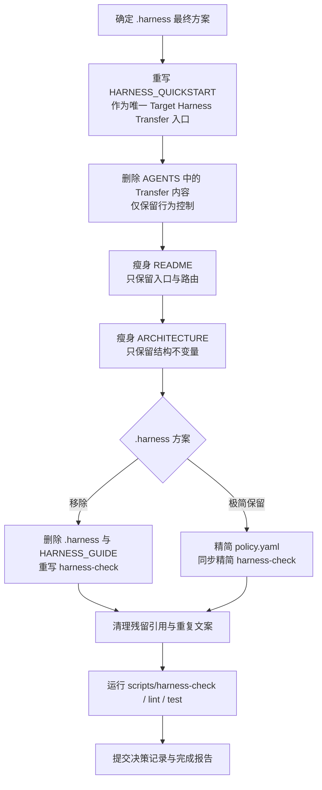

# harness-engineering 仓库深入审查报告

## 执行摘要

这次审查的核心结论是：你的仓库已经**成功完成了从“多模板 / 多 project type”到“统一 harness operating model”**的结构收敛，但与公开的 OpenAI《Harness engineering》原文相比，仍然保留了一层**原文中并不存在、且正在持续扩张职责的 `.harness` 机器策略层**；与此同时，`HARNESS_QUICKSTART.md` 里本该独占的 **Target Harness Transfer** 说明，目前仍有一部分泄漏到了 `README.md` 和 `AGENTS.md` 的职责范围里。原文的基线更接近“短 `AGENTS.md` + `ARCHITECTURE.md` + 结构化 `docs/` 作为记录系统 + 执行计划作为一等工件”，而不是“再加一层逐步膨胀的 policy 目录”。citeturn8view0 fileciteturn67file0L3-L15 fileciteturn68file0L8-L36 fileciteturn72file0L36-L75

从当前实现看，仓库已经具备几个很强的基础：`README.md` 已经形成“葡萄串式”入口；`AGENTS.md` 已压缩为约 61 行，明显比“大而全手册”更接近原文；`.harness` 已从五个文件合并为单一 `policy.yaml`；`scripts/harness-check` 也已切到单文件消费并会拒绝 legacy policy 文件。也就是说，仓库现在不是“坏结构”，而是已经进入**第二阶段：重新划清职责边界、去除额外抽象层、让入口更单纯**。fileciteturn71file0L43-L50 fileciteturn68file0L8-L18 fileciteturn69file0L14-L23 fileciteturn70file0L48-L69

如果目标是**更贴近公开原文、同时瘦身整个工程架构**，我给出的推荐顺序是：优先考虑**方案二：移除 `.harness`，把最小硬规则沉到 `HARNESS_QUICKSTART.md` 与 `scripts/harness-check`**；如果你仍然需要明确的 machine-entry，再采用**方案三：保留 `.harness`，但极度精简为仅机器入口**；而不是继续让 `.harness/policy.yaml` 承担越来越多的人类解释职责。与此同时，`HARNESS_QUICKSTART.md` 应成为唯一面向“如何把这套 harness 用到目标项目”的文档，`AGENTS.md` 则收敛为**纯行为控制**，不再包含 Target Harness Transfer。citeturn8view0turn6search0 fileciteturn68file0L19-L36 fileciteturn72file0L36-L75

## 审查范围与基线

本报告按“**仓库默认分支的最新可见快照**”进行审查；由于当前可访问证据中**未直接显示分支名与提交哈希**，故分支记为“默认分支”，提交哈希记为“未指定”。这一点我不会额外猜测。报告使用的仓库证据，来自你在对话中已加载的最新文件快照。  

本次重点文件范围包括：`README.md`、`AGENTS.md`、`HARNESS_QUICKSTART.md`、`ARCHITECTURE.md`、`.harness/policy.yaml`、`scripts/harness-check`、`docs/HARNESS_GUIDE.md`，并参考 `README` 中对 `docs/GIT_POLICY.md`、`docs/QUALITY.md`、`docs/RELIABILITY.md`、`docs/SECURITY.md`、`docs/product-specs/`、`docs/exec-plans/`、`docs/decisions/`、`docs/references/` 的路由设计。fileciteturn47file0L9-L24 fileciteturn47file0L26-L41 fileciteturn73file0L7-L23

此外，我把你此前上传的《Consolidate Harness Policy》计划作为补充背景，因为它明确提出了“把五个 `.harness/*.yaml` 合并为 `.harness/policy.yaml`，并收缩 `AGENTS.md`”的方向；而你当前仓库快照已经落实了这一点，所以可以把它视为“设计意图”和“现状落地”之间的一次对照。fileciteturn0file0 fileciteturn67file0L3-L15 fileciteturn68file0L8-L18

公开原文的比较基线来自 OpenAI 发布的《工程技术：在智能体优先的世界中利用 Codex》。原文的关键原则有三条：其一，**不要把 `AGENTS.md` 做成百科全书，而要让它成为目录 / 地图**；其二，**把仓库内版本化文档做成记录系统**；其三，**架构不变量和执行计划要以可发现、可维护、可验证的方式长期沉淀在仓库中**。这些是本报告判断“与原文一致 / 偏离”的主要参照。citeturn8view0turn6search0

## 与公开 Harness Engineering 原文的总体对比

公开原文非常明确地反对“一个巨大的 `AGENTS.md`”，原因包括：上下文预算稀缺、所有东西都重要会导致什么都不重要、巨型手册极易腐烂、而且很难做机械检查。原文因此把 `AGENTS.md` 定位为“内容目录”，主张让**短 `AGENTS.md` 指向更深层的真实信息源**，并把 `docs/` 作为记录系统。原文甚至给出了一个典型布局，其中同时存在 `AGENTS.md`、`ARCHITECTURE.md`、`docs/exec-plans/`、`docs/product-specs/`、`docs/references/`、`RELIABILITY.md`、`SECURITY.md` 等工件。citeturn8view0turn6search0

你的当前仓库与原文**一致**的部分主要有四点。第一，`README.md` 已经不再是模板选择器，而是总入口与路由图；第二，`AGENTS.md` 已经压到较短篇幅，并以 Startup Protocol、Hard Rules、Checks、Completion Report 这类行为性内容为主；第三，`ARCHITECTURE.md` 的四层模型与依赖方向，在意图上符合原文所说的“架构文档提供顶层地图”；第四，执行与知识层已经围绕 `docs/` 展开，而不是把所有规则塞进单点说明。fileciteturn47file0L9-L24 fileciteturn68file0L8-L18 fileciteturn73file0L7-L23 citeturn8view0

你的当前仓库与原文**不一致或超出原文**的部分，集中在 `.harness`。当前仓库把 `.harness/policy.yaml` 定义为唯一机器可读 policy contract，并按 `harness / workspace / structure / commands / git / quality / architecture` 分层组织；`scripts/harness-check` 也已切到只消费这个文件，并在发现 legacy policy 文件时拒绝通过。这个设计自身是自洽的，但它不是公开原文的主轴。原文强调的是“短 AGENTS + structured docs + architecture map + lints / CI”，并没有再单独提出一层 `.harness` 目录。换句话说，`.harness` 是你在原文之上添加的**额外抽象层**，而不是原文本身要求的结构。fileciteturn67file0L3-L15 fileciteturn67file0L16-L67 fileciteturn69file0L14-L23 fileciteturn70file0L48-L69 citeturn8view0

更关键的是，原文反对的是“把大量长期规则堆成一个高上下文成本、难维护的 blob”。而你现在虽然没有回到“大 `AGENTS.md`”，却有一点在**把这个问题搬到 `.harness/policy.yaml` 上**：规则虽然变成了 YAML，但职责已经开始涵盖仓库身份、workspace、结构、命令、git、quality、architecture 多个层面，文档又需要 `HARNESS_GUIDE.md` 解释它的意义。只要这个文件继续扩张，它就会重新制造一个“第二个大手册”的问题，只是载体从 Markdown 变成了 YAML。fileciteturn67file0L3-L168 fileciteturn51file0L48-L70 citeturn8view0

## 逐文件职责审查

下表是对核心文件的职责、与原文一致性、以及当前重叠点的逐项审查。该判断以当前仓库快照为证据。fileciteturn47file0L9-L24 fileciteturn68file0L8-L36 fileciteturn72file0L36-L75 fileciteturn73file0L7-L49 citeturn8view0

| 文件 | 当前职责 | 与原文一致性 | 当前重叠或模糊点 | 建议结论 |
|---|---|---|---|---|
| `README.md` | 仓库说明、入口路由、四层模型、文档落地路由、目标项目初始化摘要。fileciteturn47file0L9-L24 fileciteturn71file0L43-L50 | 基本一致。原文也强调入口地图与渐进披露。citeturn8view0 | “初始化目标项目”细节与 `HARNESS_QUICKSTART.md` 重叠。fileciteturn71file0L43-L50 fileciteturn72file0L36-L75 | 保留；删去详细 transfer 步骤，只保留一句链接到 QUICKSTART。 |
| `HARNESS_QUICKSTART.md` | 当前已声明“不是 template selector”，并承担 target harness bootstrap、transfer rules、本地 policy 子集约束说明。fileciteturn49file0L3-L7 fileciteturn72file0L36-L75 | 方向上与原文的“渐进披露”和“给地图而不是手册”一致，但 QUICKSTART 是你自己的扩展层。citeturn8view0 | 目标项目使用说明没有完全独占；README 与 AGENTS 仍然重复了其中一部分。fileciteturn71file0L43-L50 fileciteturn68file0L19-L36 | 应升级为**唯一**面向“怎么把 harness 用到目标项目”的文档。 |
| `AGENTS.md` | Startup Protocol、Target Harness Transfer、Documentation Lifecycle、Hard Rules、Checks、Completion Report。fileciteturn68file0L8-L61 | 只要保持短小与行为导向，就符合原文；但包含 transfer 内容时会偏离“目录 / 行为控制”定位。citeturn8view0 | `Target Harness Transfer` 明显属于 QUICKSTART，而非 AGENTS。Documentation Lifecycle 也有一部分和 README/QUICKSTART 再次重述。fileciteturn68file0L19-L36 | 保留 Startup / Hard Rules / Checks / Completion；删除 Transfer；压缩 Lifecycle。 |
| `ARCHITECTURE.md` | 系统边界、四层结构、目录职责、依赖方向、规则沉淀顺序、变更要求。fileciteturn73file0L7-L23 fileciteturn73file0L35-L49 | 与原文高度一致；原文明确认可架构文档是顶层地图。citeturn8view0 | “目录职责”与 README 路由、`docs/HARNESS_GUIDE.md` 的解释有重复。fileciteturn73file0L25-L33 | 必须保留，但只保留结构不变量与依赖方向，删掉目录导览部分。 |
| `.harness/policy.yaml` | 机器可读 contract，集中表达 harness / workspace / structure / commands / git / quality / architecture。fileciteturn67file0L3-L168 | 原文未显式包含这一层，因此是“超出原文”的扩展。citeturn8view0 | 与 `AGENTS.md`、`HARNESS_GUIDE.md`、`scripts/harness-check` 形成三角重复：人类解释、配置表达、脚本消费同时存在。fileciteturn51file0L48-L70 fileciteturn70file0L48-L69 | 需要在三种方案中二选一或三选一，不宜继续自然膨胀。 |
| `scripts/harness-check` | 消费单一 policy 文件，执行 required files / dirs / commands / gitignore / artifact / AGENTS 限制等检查。fileciteturn69file0L14-L23 fileciteturn70file0L48-L69 | 与原文的“linter / structural tests / CI 机械执行不变量”高度一致。citeturn8view0 | 如果 `.harness` 被删除，脚本职责必须重写；否则脚本与 YAML 的耦合会继续加深。 | 保留，但让它服务于“最少必要的不变量”，不要反向牵引文档结构。 |
| `docs/HARNESS_GUIDE.md` | 解释 `.harness/*.yaml` 是 machine-readable contract，不是 prose docs。fileciteturn51file0L48-L70 | 若保留 `.harness`，它有解释价值；若移除 `.harness`，则会失去核心存在理由。 | 与 `ARCHITECTURE.md`、QUICKSTART 对 “四层 / policy / checks” 的说明有重叠。 | 取决于 `.harness` 方案：保留时缩短；移除时删掉或并入其他文档。 |

一个重要的非结论是：`docs/product-specs/`、`docs/exec-plans/`、`docs/decisions/`、`docs/references/` 这些**不是冗余层**，反而是与你想遵循的公开原文最一致的部分。原文明确把产品规格、执行计划、参考资料、架构与可靠性/安全这些工件视为仓库内“记录系统”的组成部分，并强调计划是 first-class artifact。citeturn8view0turn6search0

## .harness 的三种方案

当前 `.harness/policy.yaml` 已经是单文件 contract，而 `scripts/harness-check` 也已围绕它实现；因此，关于 `.harness` 的决策，不是“是否已经存在”，而是“是否还值得继续作为独立架构层存在”。公开原文并不要求这一层，所以这一步实际上是在决定：你是要**保留自己的扩展层**，还是**回到更接近原文的短入口 + docs + checks 模型**。fileciteturn67file0L3-L168 fileciteturn69file0L14-L23 citeturn8view0

| 方案 | 核心做法 | 优点 | 缺点 | 实施步骤 | 影响范围 | 回退策略 | 脚本 / 解析器改动 |
|---|---|---|---|---|---|---|---|
| **保留并继续使用单一 `policy.yaml`** | 维持 `.harness/policy.yaml`，但继续作为完整 machine-policy contract。 | 对当前实现最平滑；`scripts/harness-check` 已经只消费单文件；现有校验链不需要大改。fileciteturn69file0L14-L23 | 最偏离公开原文；容易继续膨胀成第二个“大手册”；`HARNESS_GUIDE` 与 AGENTS/README 的解释重复难以停止。citeturn8view0 fileciteturn51file0L48-L70 | 精简字段；删除叙述性内容；把每个 section 限制为脚本确实会消费的 key。 | 低到中。主要影响 `.harness/`、`HARNESS_GUIDE`、`harness-check`。 | 直接回退到当前提交即可。 | 低。只需加强“只允许受支持子集”的校验。 |
| **移除 `.harness`，把最小硬规则放入 QUICKSTART 与脚本常量** | 删除 `.harness/`；把“目标项目如何使用 harness”的硬规则留在 `HARNESS_QUICKSTART.md`；把真正需要机械执行的限制直接写进 `scripts/harness-check`。 | 与公开原文最接近；减少一整层抽象；文档职责更清晰：README 入口、QUICKSTART 使用、AGENTS 行为、ARCHITECTURE 架构、docs 记录系统。citeturn8view0turn6search0 | 失去单独 machine-readable contract；硬规则会分散在 QUICKSTART 与脚本中；若以后想外部复用，迁移性略差。 | 删除 `.harness/policy.yaml`；改写 `harness-check` 为“脚本内常量 + repo 检查”；清理 README/AGENTS/ARCHITECTURE/HARNESS_GUIDE 引用。 | 中到高。影响 `.harness`、`HARNESS_GUIDE`、`harness-check`、README/AGENTS/QUICKSTART。 | 在一个独立提交中执行；若不满意，可直接恢复 `.harness/policy.yaml` 与当前 parser。 | 中到高。要移除当前 parser 路径，把必要规则固化到脚本。 |
| **保留 `.harness`，但极度精简为仅 machine-entry** | `.harness/policy.yaml` 只保留 15–30 行左右的“脚本入口信息”，例如命令入口、禁止提交目录、AGENTS 上限、legacy 文件禁令。 | 兼顾 machine-entry 与瘦身；保留低成本 parser；最能避免 YAML 成为第二文档系统。 | 仍然保留额外层；需要强纪律，防止未来再次长大。 | 砍掉 `harness / workspace / architecture` 中叙述性字段，只留下脚本真正消费的 key；把解释迁回 README/ARCHITECTURE/QUICKSTART。 | 中。影响 `.harness/`、`HARNESS_GUIDE`、`harness-check`。 | 可从历史提交恢复完整 policy。 | 中。需要同步重构 parser 和检查逻辑，只读取极少数字段。 |

如果你的目标优先级是“**与公开原文尽量一致 + 最大幅度降低职责模糊**”，我更倾向于**方案二**。如果你的目标优先级是“**还想保留一个廉价的机器入口，但不想再养一个大 policy 层**”，我倾向于**方案三**。只有当你明确接受“`.harness` 是原文之外的自定义扩展层”，并准备长期维护这层解释与校验的时候，才建议继续使用方案一。citeturn8view0 fileciteturn51file0L48-L70

## HARNESS_QUICKSTART 与 AGENTS 的重构建议

你提出的判断非常关键：**除了 `HARNESS_QUICKSTART.md`，其他地方不应该再承担 Target Harness Transfer 的说明**。这个判断与当前仓库的实际重叠点完全吻合。现在 `HARNESS_QUICKSTART.md` 已经承担了 bootstrap 与 transfer 规则，但 `README.md` 仍保留了“初始化目标项目”的步骤摘要，`AGENTS.md` 也仍有整段 `Target Harness Transfer`。这会让 Agent 在三个地方都读到“怎么迁移到目标项目”，从而造成入口冗余。fileciteturn71file0L43-L50 fileciteturn68file0L19-L36 fileciteturn72file0L36-L75

重构建议可以压成一条原则：**`HARNESS_QUICKSTART.md` = 唯一目标项目使用说明；`README.md` = 只给路由；`AGENTS.md` = 只约束 Agent 行为；`ARCHITECTURE.md` = 只陈述本仓库结构不变量。** 这会显著减少重复。它也比当前结构更接近公开原文，因为原文的重点从来不是“到处重复一次目标项目迁移流程”，而是“把知识放在合适层级，保持可发现、可验证”。citeturn8view0turn6search0

一个可直接落地的 `HARNESS_QUICKSTART.md` 改写草案，可以像下面这样收束。这里我特意把 **Target Harness Transfer** 放成唯一的目标项目说明入口，并避免其他文档再重复它：

```md
# HARNESS_QUICKSTART

Use this file to start harness engineering work quickly.

1. Read `README.md` to understand this repository and find the correct documents.
2. If your task is inside this repository, follow local docs and local checks only.
3. If your task is to apply this method to another project, this file is the only place to read target-project transfer rules.
4. Inspect the target repository boundary and current project state.
5. Decide which durable artifacts are needed: product spec, exec plan, decision record, reference note, or policy/check updates.
6. Create or update only the target-local artifacts that are required by the task.
7. Keep product and architectural explanation in docs, not in agent instructions.
8. Keep mechanical validation in scripts, lint, tests, hooks, or CI.
9. Do not use `AGENTS.md` or `ARCHITECTURE.md` as target transfer manuals.
10. After bootstrap, follow the target repository’s own local rules.
```

围绕这个 QUICKSTART，其他文件的引用应该同步调整。`README.md` 的“初始化目标项目”段建议改成一句链接：**“若要把本方法应用到目标项目，请仅按 `HARNESS_QUICKSTART.md` 执行。”** `AGENTS.md` 应彻底删除 `Target Harness Transfer` 整段。`ARCHITECTURE.md` 里可以增加一句边界声明：**“Target-project transfer process is documented only in `HARNESS_QUICKSTART.md`.”** 若保留 `docs/HARNESS_GUIDE.md`，它也不应重复 transfer 步骤，只解释保留文件的存在理由。fileciteturn71file0L43-L50 fileciteturn68file0L19-L36 fileciteturn73file0L25-L33

针对 `AGENTS.md`，当前最适合的处理方式不是“再压缩成更短的说明书”，而是**只保留四类东西：Startup Protocol、Hard Rules、Checks、Completion Report**。具体建议如下：  

| `AGENTS.md` 当前部分 | 建议 | 原因 |
|---|---|---|
| 仓库身份说明 + Startup Protocol fileciteturn68file0L8-L18 | **保留** | 这正是 AGENTS 的本职：告诉 Agent 开始工作前必须先做什么。 |
| `Target Harness Transfer` fileciteturn68file0L19-L29 | **删除并迁移到 QUICKSTART** | 这段不是“行为控制”，而是“如何把方法用到目标项目”，应只留在 QUICKSTART。 |
| Documentation Lifecycle Rules fileciteturn68file0L30-L36 | **压缩保留** | 建议收成一句硬规则：当任务改变行为/架构/验证/边界时，更新对应 docs 与 checks。不要再列目录地图。 |
| Hard Rules fileciteturn68file0L37-L47 | **保留** | 这是 AGENTS 最应该承载的内容。 |
| Checks fileciteturn68file0L49-L54 | **保留** | Agent 需要知道交付前要跑哪些命令。 |
| Completion Report fileciteturn68file0L55-L61 | **保留** | 这能强制形成可审查输出。 |

如果你最终选择**移除 `.harness`**，那么 `AGENTS.md` 里所有提到 `.harness/policy.yaml` 的句子都应删除，改成更抽象但更稳定的表述，例如：**“Keep durable human-readable rules in repo-local docs; keep mechanical enforcement in scripts and checks.”** 如果你选择**保留极简 `.harness`**，则 `AGENTS.md` 只保留一句：**“If the repository uses a machine-entry file, keep it minimal and consumed by checks.”** 这样就不会再把 AGENTS 变成 policy 字段说明书。fileciteturn67file0L3-L168 fileciteturn70file0L48-L69

## 冗余文件与瘦身清单

严格来说，你当前仓库并不存在大量“完全没有意义的文件”；真正的问题是**少数文件的职责发生了部分重叠**。所以更准确的动作不是大规模删除，而是“保留需要的层、删掉不该重复的部分、在少数情况下做合并”。证据表明，重复最集中在 `.harness`—`HARNESS_GUIDE`—`AGENTS`—`README` 这一组与 target transfer / machine policy 相关的内容上。fileciteturn51file0L48-L70 fileciteturn68file0L19-L36 fileciteturn71file0L43-L50

| 文件 / 内容 | 当前问题 | 建议动作 |
|---|---|---|
| `.harness/policy.yaml` | 与原文基线不一致；与 `HARNESS_GUIDE`、`AGENTS`、`harness-check` 构成额外层。fileciteturn67file0L3-L168 | 三选一：保留、移除、或极简化。若选移除，则整层删除。 |
| `docs/HARNESS_GUIDE.md` | 大量内容存在于 `.harness` 解释与四层说明，若 `.harness` 移除则核心理由消失。fileciteturn51file0L48-L70 | 若移除 `.harness`：删除或并入 `ARCHITECTURE.md` / QUICKSTART；若保留 `.harness`：只保留一页短说明。 |
| `README.md` 的“初始化目标项目”段 | 与 QUICKSTART 重复。fileciteturn71file0L43-L50 fileciteturn72file0L36-L75 | 不删文件，只删这段细节，改成单句链接。 |
| `AGENTS.md` 的 `Target Harness Transfer` 段 | 与 QUICKSTART 重复，且角色不对。fileciteturn68file0L19-L29 | 不删文件，只删整段并迁移至 QUICKSTART 独占。 |
| `ARCHITECTURE.md` 的“目录职责”段 | 与 README 的路由 / HARNESS_GUIDE 的解释重复。fileciteturn73file0L25-L33 | 不删文件，只删除该段，保留结构不变量。 |
| `docs/GIT_POLICY.md`、`docs/QUALITY.md`、`docs/RELIABILITY.md`、`docs/SECURITY.md` | 目前没有明确冗余证据；反而更接近原文 flat docs 的风格。citeturn8view0turn6search0 | **保留**。 |
| `docs/product-specs/`、`docs/exec-plans/`、`docs/decisions/`、`docs/references/` | 它们正是原文“记录系统”模型的核心。citeturn8view0turn6search0 | **保留**。 |

就“删文件”这件事本身，我的判断很明确：**如果你最终决定移除 `.harness`，最自然的连带动作就是删除 `docs/HARNESS_GUIDE.md`，或者把其中极少量仍有价值的解释并入 `ARCHITECTURE.md`。** 反过来，如果你不删 `.harness`，那至少也要让 `HARNESS_GUIDE.md` 缩到明显短于现在的程度，否则等于同时维护“policy + guide + AGENTS + QUICKSTART”四份近邻规则。fileciteturn51file0L48-L70

## 实施计划与短期行动

下面给出一个按优先级排序的实施计划。这里我假设你优先考虑**方案二：移除 `.harness`**；如果最终选方案三，步骤次序基本不变，只是第一个决策点改成“保留极简 machine-entry”。当前结构已经比较干净，因此风险并不在“会不会破坏仓库”，而在“会不会改完以后又重新把职责写回去”。fileciteturn67file0L3-L168 fileciteturn68file0L8-L61

| 步骤 | 目标 | 预估工时 | 风险等级 | 回退点 |
|---|---|---:|---|---|
| 选定 `.harness` 方案 | 在 A/B/C 中明确选一个，避免边改边摇摆 | 0.5–1 小时 | 低 | 决策记录或单独 issue / exec-plan |
| 重写 `HARNESS_QUICKSTART.md` | 让它成为唯一目标项目使用说明 | 1–2 小时 | 低 | 单独提交，便于回滚 |
| 收缩 `AGENTS.md` | 删除 `Target Harness Transfer`，只留行为控制 | 0.5–1 小时 | 低 | 单独提交 |
| 瘦身 `README.md` 与 `ARCHITECTURE.md` | README 只做入口；ARCHITECTURE 只讲结构不变量 | 1–2 小时 | 低 | 单独提交 |
| 处理 `.harness` 与 `HARNESS_GUIDE` | 方案二则删除；方案三则极简化 | 1–3 小时 | 中 | 保留一个完整回退提交 |
| 修改 `scripts/harness-check` | 让校验逻辑适配最终架构 | 2–4 小时 | 中到高 | 独立提交，必要时直接 revert |
| 清理残留引用并验证 | `rg` 检查旧引用，跑脚本、lint、test | 0.5–1 小时 | 低 | 最终验证前都可回滚 |

下面这个 mermaid 流程图展示了更适合的实施顺序：



最后给出五条最短期、最可执行的动作。它们不依赖你先做完整重构，可以直接开始。

把 `HARNESS_QUICKSTART.md` 改成唯一的 Target Harness Transfer 文档。  
从 `AGENTS.md` 中整段删除 `Target Harness Transfer`。  
把 `README.md` 里的目标项目初始化步骤压缩成一句跳转到 QUICKSTART。  
把 `ARCHITECTURE.md` 的“目录职责”段删掉，只保留结构边界与依赖方向。  
在 `.harness` 三方案中拍板一次，不再让 policy 层继续自然膨胀。