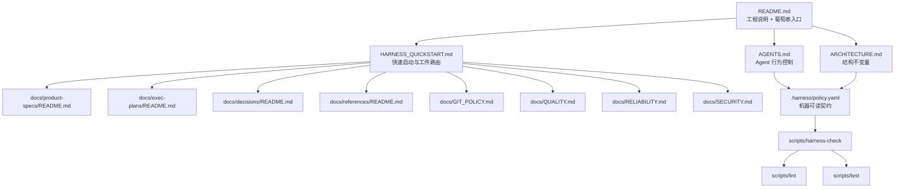

# 对比当前仓库与公开 Harness Engineering 原文的逐文件职责核查与收敛报告

## 执行摘要

公开 Harness Engineering 原文给出的基线非常清楚：**不要把 `AGENTS.md` 写成百科全书，而要把它当作短地图；把结构化 `docs/` 当作记录系统；把 `ARCHITECTURE.md` 当作顶层结构地图；把 `exec-plans`、`product-specs`、`references` 这类长期工件纳入版本控制**。OpenAI 公开文章明确强调了“短 `AGENTS.md` + `docs/` 作为 system of record + `ARCHITECTURE.md` 顶层地图 + 计划作为一等工件”的组合。citeturn11view0turn13search0turn12view0

你当前仓库已经明显朝这个方向收敛：根 `README.md` 负责总入口与路线图，`HARNESS_QUICKSTART.md` 不再是模板选择器，而是指导 Agent 判断下一步该读、该建、该改什么 durable artifact；`.harness` 已经合并为单一 `.harness/policy.yaml`；`scripts/harness-check` 也已经切换为只消费这一个机器契约文件。fileciteturn47file0L3-L24 fileciteturn49file0L3-L7 fileciteturn67file0L3-L168 fileciteturn69file0L14-L23

但当前仓库仍有两类职责边界不够清楚。第一类是**入口层内部的重叠**：`README.md`、`HARNESS_QUICKSTART.md`、`AGENTS.md`、`ARCHITECTURE.md`、`docs/HARNESS_GUIDE.md` 都在不同程度上解释“这个工程是什么、怎么开始、各层干什么”，导致 Agent 很容易在多个文件里读到相似话术。第二类是**prose docs 与 machine policy 的边界不清**：`GIT_POLICY.md`、`QUALITY.md`、`RELIABILITY.md`、`SECURITY.md` 与 `.harness/policy.yaml` 都在谈“规则”，但并不是所有规则都适合进入机器契约。fileciteturn47file0L26-L50 fileciteturn51file0L48-L70 fileciteturn73file0L7-L49

本报告的核心结论是：

第一，**保留四层架构，但继续瘦身**。推荐稳定为：`README / AGENTS / QUICKSTART` 作为入口层，`ARCHITECTURE + docs/*` 作为知识层，`.harness/policy.yaml` 作为机器契约层，`scripts/*` 作为执行检查层。fileciteturn73file0L7-L23 fileciteturn67file0L68-L168

第二，**`ARCHITECTURE.md` 应保留，但必须瘦身为“结构不变量文档”**。它应该只讲层级、依赖方向、职责边界、变更耦合，不再承担目录说明与 quickstart 导航。公开原文明确保留了 `ARCHITECTURE.md`，并用它来提供“域和包分层的顶层地图”。citeturn11view0 fileciteturn73file0L35-L49

第三，**`GIT_POLICY.md`、`QUALITY.md`、`RELIABILITY.md`、`SECURITY.md` 不应整体并入 `.harness/policy.yaml`**。`.harness/policy.yaml` 只应保存可被脚本消费、可被机械检查的约束；政策说明、权衡、触发条件、风险边界仍应保留为 prose docs。当前仓库自己的 `HARNESS_GUIDE.md` 已经把 `.harness/*.yaml` 定义成 machine-readable contract，而不是第二套 prose docs。fileciteturn51file0L48-L70

第四，**`AGENTS.md` 需要继续精简**。公开原文把 `AGENTS.md` 当作“目录/地图”；AGENTS.md 官方规范则把它定义为“给 Agent 的 README”，用于放构建、测试、约束和注意事项。你当前仓库的 `AGENTS.md` 已经比之前短很多，但仍混入了一部分本该留给 `README` / `QUICKSTART` 的路由说明。citeturn11view0turn12view0 fileciteturn68file0L8-L36

第五，**`docs/HARNESS_GUIDE.md` 是当前最适合被合并掉的文件**。它的角色与 `README.md`、`HARNESS_QUICKSTART.md`、`ARCHITECTURE.md` 存在显著交叉。若目标是“层次更清晰、仓库更瘦”，推荐把它对 `.harness` 的解释并入 `ARCHITECTURE.md`，把方法入口并回 `README.md`，然后删除这个单独文件。fileciteturn51file0L48-L70 fileciteturn47file0L9-L24 fileciteturn73file0L25-L49

## 对照基线

公开 Harness Engineering 原文不是在教人堆更多文件，而是在教人**让 Agent 可导航、可验证、可持续运行**。它强调的不是“说明书越多越好”，而是“给 Agent 一张地图，而不是一本 1000 页手册”。公开文章明确说明，单一大型 `AGENTS.md` 会挤占上下文、迅速陈旧、难以机械检查，因此应改为短 `AGENTS.md`，并把知识库放进结构化 `docs/` 目录。citeturn11view0

公开文章展示的仓库布局里，`AGENTS.md`、`ARCHITECTURE.md`、`docs/design-docs/`、`docs/exec-plans/`、`docs/product-specs/`、`docs/references/`、`RELIABILITY.md`、`SECURITY.md` 等文件共同构成了“记录系统”。文章还特别指出：`ARCHITECTURE.md` 用来提供域和包分层的顶层地图；`exec-plans` 是一等工件；活跃计划、已完成计划、技术债都应版本化管理。citeturn11view0turn13search0

与此同时，AGENTS.md 官方规范强调，`README.md` 面向人类，`AGENTS.md` 面向 Agent，适合放构建命令、测试方法、代码规范、安全注意事项，而不是把 README 和 durable docs 全部复制进去。规范还强调 `AGENTS.md` 本身没有强制字段，但它应提供清晰、可预测、与 Agent 工作直接相关的上下文。citeturn12view0

你的仓库目前已经建立了一个本地适配版：`README.md` 作为总入口，`HARNESS_QUICKSTART.md` 作为快速操作子流程，`.harness/policy.yaml` 作为统一机器契约，`scripts/harness-check` 作为消费该契约的机械检查器。这个适配方向没有问题；问题不在于“偏离公开原文”，而在于**文件边界还没有最终收敛**。fileciteturn47file0L3-L24 fileciteturn72file0L36-L75 fileciteturn67file0L3-L168

下面这个图给出推荐的最终收敛形态。



## 逐文件职责核查与收敛表

下表以**当前默认分支**为优先基准，并与公开原文或相关官方规范对照。对于本轮未直接读取正文的文件，我标注为“未指定”；这类文件的存在性可由 `README` 路由与 `.harness/policy.yaml` 的 `required_files` 确认。fileciteturn47file0L26-L50 fileciteturn67file0L16-L67

| 文件名 | 当前职责 | 建议职责 | 与原文职责一致 | 冲突/重复文件 | 操作建议 |
|---|---|---|---|---|---|
| `README.md` | 工程说明、先读什么、四层模型、文档落地路由、目标项目初始化摘要。fileciteturn47file0L3-L24 fileciteturn47file0L26-L50 | **唯一总入口**：说明仓库是什么、Agent 必读顺序、各工件去哪儿、执行检查点是什么。不要展开详细步骤。 | 否。公开原文更强调 `AGENTS.md` 是地图；你这里把 README 提升为顶层葡萄串入口，是合理本地化，但不是原文原位职责。citeturn11view0turn12view0 | `HARNESS_QUICKSTART.md`、`docs/HARNESS_GUIDE.md` | **保留并重写**：压缩“初始化目标项目”细节，只保留总路由。 |
| `AGENTS.md` | 启动协议、目标项目迁移、文档/政策同步、硬规则、检查命令与完成报告。fileciteturn68file0L8-L36 | **仅做 Agent 行为控制**：工作前怎么读、工作中不能做什么、何时同步 durable docs 与 policy、交付时必须报什么。 | 否。公开原文把 AGENTS 更明确当作“目录/地图”；AGENTS.md 官方规范则允许放构建/测试/约束。你的最终版本建议更靠近“行为控制”，因此应更短。citeturn11view0turn12view0 | `README.md`、`HARNESS_QUICKSTART.md` | **保留并重写**：删掉目录解释，只保留行为规则。 |
| `HARNESS_QUICKSTART.md` | 不再是模板选择器，而是决定下一步该读/建/改哪个 durable artifact，并给出 target harness 转移规则。fileciteturn49file0L3-L7 fileciteturn72file0L36-L75 | **README 的操作子流程**：说明如何快速启动 harness 工程化管理，如何判断当前任务属于哪类工件更新。 | 否。公开原文没有这个文件；这是你对公开方法的本地工程化补充。citeturn11view0turn13search0 | `README.md`、`docs/HARNESS_GUIDE.md` | **保留并重写**：只保留“阶段判断 + 工件路由 + 检查步骤”，不要重复工程说明。 |
| `ARCHITECTURE.md` | 讲系统边界、目录职责、依赖方向、规则沉淀顺序、变更要求。fileciteturn73file0L7-L49 | **结构不变量文档**：只说明四层架构、依赖方向、职责边界、变更耦合。 | 是。公开原文明确保留 `ARCHITECTURE.md` 作为顶层地图。citeturn11view0 | `README.md`、`docs/HARNESS_GUIDE.md` | **保留并重写**：删除“目录职责/怎么开始”的说明，只保留结构规则。 |
| `.harness/policy.yaml` | 单一机器可读契约，包含 `harness/workspace/structure/commands/git/quality/architecture`。fileciteturn67file0L3-L168 | **唯一机器合约**：只放脚本能消费、能验证、能失败的规则。 | 否。公开原文没有这一层；这是你仓库的有效扩展。citeturn11view0 | `GIT_POLICY.md`、`QUALITY.md`、`RELIABILITY.md`、`SECURITY.md` | **保留**：但只收可机械检查字段，不收解释性内容。 |
| `docs/HARNESS_GUIDE.md` | 当前至少承担“.harness 是 machine-readable contract，不是第二套 prose docs”的说明。fileciteturn51file0L48-L70 | 若保留，应只讲“这个方法仓库里的工件种类各自干什么”；若追求瘦身，应把其内容拆回 `README.md` 与 `ARCHITECTURE.md`。 | 否。公开原文没有这个独立文件。citeturn11view0 | `README.md`、`HARNESS_QUICKSTART.md`、`ARCHITECTURE.md` | **建议合并到 `README.md` + `ARCHITECTURE.md` 后删除**。这是当前最明显的冗余点。 |
| `docs/GIT_POLICY.md` | 当前定位是说明何时读、何时更新，以及 `.harness` / `.gitignore` / prose doc 之间的关系。fileciteturn40file0L8-L28 | **Git 边界的 prose policy**：说明为什么、何时、怎么判断；把路径黑名单与机械约束镜像到 `.harness/policy.yaml` 和 `.gitignore`。 | 否。公开原文未必有同名文件，但与“记录系统中的治理文档”精神一致。citeturn11view0 | `.harness/policy.yaml`、`.gitignore` | **保留并重写**：不要并入 policy；只保留人类判断与边界说明。 |
| `docs/QUALITY.md` | 未直接检阅正文；从 README 路由与 policy required_files 看，属于治理文档。fileciteturn47file0L26-L41 fileciteturn67file0L16-L67 | **质量治理的 prose doc**：什么叫完成、验证等级、证据要求、哪些必须写进报告。 | 否。公开原文更明确提到 `QUALITY_SCORE.md` 这类质量跟踪文档，但不是单纯机器契约。citeturn11view0 | `.harness/policy.yaml` | **保留**：只把可机检的最小字段（如 verification report 要求、minimum checks）镜像到 policy。 |
| `docs/RELIABILITY.md` | 未直接检阅正文；从 README 路由与 policy required_files 看，属于治理文档。fileciteturn47file0L26-L41 fileciteturn67file0L16-L67 | **可靠性治理的 prose doc**：失败模式、回滚、恢复、运行期约束、SLO/验证方式。 | 是。公开原文保留了 `RELIABILITY.md`。citeturn11view0 | `.harness/policy.yaml` | **保留**：仅把可机械检查的边界同步到 policy。 |
| `docs/SECURITY.md` | 未直接检阅正文；从 README 路由与 policy required_files 看，属于治理文档。fileciteturn47file0L26-L41 fileciteturn67file0L16-L67 | **安全治理的 prose doc**：威胁模型、敏感操作边界、审批条件、秘密处理规则。 | 是。公开原文保留了 `SECURITY.md`。citeturn11view0 | `.harness/policy.yaml`、`.gitignore` | **保留**：只把 secrets/敏感路径 denylist 等可机检子集同步到 policy。 |
| `docs/product-specs/README.md` | 规定何时写、必填内容、禁止内容和验证要求。fileciteturn36file0L7-L31 | **产品规格总则**：何时产出规格、规格至少包含什么、不能写成什么。 | 是。公开原文明确有 `product-specs/`。citeturn11view0 | 无明显重叠，仅可能被 README 简略提及 | **保留**。 |
| `docs/exec-plans/README.md` | 规定 active/completed/tech-debt 规则与迁移规则。fileciteturn37file0L7-L39 | **执行计划总则**：何时建计划、计划怎么迁移、如何记录验证结果。 | 是。公开原文与 OpenAI Cookbook 都把执行计划视为一等工件。citeturn11view0turn13search0 | `HARNESS_QUICKSTART.md` 有轻微操作交叉 | **保留**。 |
| `docs/decisions/README.md` | 说明何时记录长期决策以及 ADR 必填字段。fileciteturn39file0L7-L25 | **长期决策记录总则**：什么级别的决定必须落 ADR，采用什么最小字段。 | 否。公开原文更接近 design-docs/core-beliefs，并未明确给独立 ADR 目录，但方向一致。citeturn11view0 | `ARCHITECTURE.md` 可能有少量决策解释重叠 | **保留**。 |
| `docs/references/README.md` | 规定外部依据的 Source、Date、Summary、Applies to。fileciteturn38file0L7-L25 | **外部参考资料总则**：如何沉淀外部事实依据与适用范围。 | 是。公开原文明确有 `references/`。citeturn11view0 | 无明显重叠 | **保留**。 |
| `scripts/harness-check` | 当前只读取 `.harness/policy.yaml`，并对 legacy `.harness/*.yaml` 报错；负责 required files/dirs、command entrypoints、`.gitignore`、large files、AGENTS line limit 等检查。fileciteturn69file0L14-L23 fileciteturn70file0L48-L69 | **唯一 harness 一致性检查器**：消费机器契约并给出可执行反馈。 | 是。公开原文批评“无法机械检查”的大块说明，`harness-check` 正是你仓库的补足。citeturn11view0 | 无明显重叠，仅与 `lint/test` 分工相邻 | **保留**。 |
| `scripts/lint` | 未直接检阅正文；从 policy commands 看是标准质量检查入口。fileciteturn67file0L16-L67 | **语法/风格/静态检查入口**。 | 是，属于标准 execution 层。 | 无 | **保留**。 |
| `scripts/test` | 未直接检阅正文；从 policy commands 看是标准验证入口。fileciteturn67file0L16-L67 | **测试入口**。 | 是，属于标准 execution 层。 | 无 | **保留**。 |
| `templates/*` | 当前不再是主线；`HARNESS_QUICKSTART.md` 已明确自己不是 template selector。fileciteturn49file0L3-L7 | **不应存在于主线设计中**。 | 否。公开原文也不是“项目类型模板分发系统”。citeturn11view0 | 与 `HARNESS_QUICKSTART.md`、`README.md` 的统一方法论直接冲突 | **若目录仍存在则删除；若已删除则维持现状**。 |
| `docs/examples/policies/*` | 本轮未见当前主线路由引用；历史上属于旧多 policy 示范。 | **不应保留**。 | 否。 | 与 `.harness/policy.yaml` 冲突 | **删除或保持删除状态**。 |

## 关键文件裁决

这里给出你最关心的几个边界判断：**到底什么该留在 prose docs，什么该归入 `.harness/policy.yaml`。**

### `ARCHITECTURE.md` 的裁决

`ARCHITECTURE.md` 应当保留。公开原文明确把 `ARCHITECTURE.md` 放在顶层，并说明它提供域与包分层的顶层地图。你当前文件也已经包含了系统边界、依赖方向、规则沉淀顺序与变更要求这些真正“架构级”的内容。citeturn11view0 fileciteturn73file0L7-L49

但它**不应该**再承担这些内容：仓库是什么、先读什么、各目录去哪儿、快速开始步骤、`.harness/policy.yaml` 字段说明。那些分别属于 `README.md`、`HARNESS_QUICKSTART.md`、`.harness/policy.yaml` 与各目录 README。也就是说，`ARCHITECTURE.md` 应只保留**结构不变量**。fileciteturn73file0L25-L49

### `GIT_POLICY.md` 的裁决

`GIT_POLICY.md` 不应整体并入 `.harness/policy.yaml`。原因很简单：Git 边界既有**可机检部分**，也有**需要人类判断的部分**。例如：禁止提交哪些路径、`.gitignore` 必须包含什么、large file 限制，这些可以进入 `.harness/policy.yaml` 并由 `harness-check` 验证；但“什么时候更新规则”“规则之间如何分层”“出现例外时如何裁决”这类内容，仍应保留为 prose docs。当前 `GIT_POLICY.md` 自己也已经在说明它与 `.harness` 和 `.gitignore` 的关系。fileciteturn40file0L8-L28 fileciteturn67file0L68-L168

因此，推荐的边界是：**`GIT_POLICY.md` 负责解释，`.harness/policy.yaml` 负责可执行约束，`.gitignore` 负责本地忽略实现。**

### `QUALITY.md`、`RELIABILITY.md`、`SECURITY.md` 的裁决

这三个文件也不应整体并入 `.harness/policy.yaml`。理由与 `GIT_POLICY.md` 相同，但更强：质量、可靠性、安全，大量内容本质上是**风险模型、权衡、触发条件、升级路径、运行期判断**，不适合硬塞到机器契约里。你当前 `.harness/policy.yaml` 已经把质量相关的最小机检字段放了进去，例如 report 要求、minimum checks、AGENTS 长度限制、required files/dirs 等；这正是正确做法。fileciteturn67file0L68-L168

因此这三个文件的标准边界应该是：

| 文件 | 是否并入 `.harness/policy.yaml` | 结论 |
|---|---|---|
| `docs/QUALITY.md` | 只并入可机检子集 | 保留 prose；把验证报告必填字段、最低检查项镜像到 policy |
| `docs/RELIABILITY.md` | 仅极少数可机检项可镜像 | 保留 prose；故障模式、回滚、恢复与运行时约束不适合整体机器化 |
| `docs/SECURITY.md` | 只并入 secrets/artifact denylist 等子集 | 保留 prose；威胁模型、审批条件与高风险操作边界不应只写在 policy |

### `docs/HARNESS_GUIDE.md` 的裁决

这是本报告里唯一建议你认真考虑**删除**的关键文件。它目前最有价值的部分，是说明 `.harness/*.yaml` 为什么是 machine-readable contract，而不是第二套 prose docs。fileciteturn51file0L48-L70

但这个作用完全可以被更清晰的两处取代：  
一处是在 `ARCHITECTURE.md` 里，把“机器契约层”的职责说清楚；  
另一处是在 `README.md` 的葡萄串入口表里，把 `.harness/policy.yaml` 标为“机器可读，先读后检”。  
这样一来，`HARNESS_GUIDE.md` 不再需要单独存活。它在当前仓库中最容易与 `README.md`、`HARNESS_QUICKSTART.md`、`ARCHITECTURE.md` 形成三重重复。fileciteturn47file0L9-L24 fileciteturn72file0L36-L75 fileciteturn73file0L35-L49

## AGENTS 精简方案

### 建议结构

建议把 `AGENTS.md` 固定为六章，而且每章只写最小必要信息：

| 章节 | 要点 |
|---|---|
| 仓库身份 | 这是方法仓库，不是目标项目长期规则源 |
| 启动协议 | 改动前必须确认边界、看哪些文件、跑什么命令 |
| 目标项目迁移 | durable rules 进目标项目本地文件，而不是长期依赖 seed |
| 同步规则 | 何种变更必须同时更新 docs / policy / checks |
| 硬规则 | MUST / MUST NOT / NEVER，只保留强约束 |
| 验证与交付 | 必跑命令、必须汇报的内容 |

### 可直接替换的精简版 `AGENTS.md` 全文

```md
# AGENTS.md

本仓库是一个 Harness 方法仓库。
它用于指导 Agent 学习并应用一套统一的项目工程化管理方法。
它不是目标项目的长期规则源；目标项目完成落地后，应以目标项目本地规则为准。

## 仓库适用范围

- 本仓库定义方法、工件类型、政策边界和检查方式。
- 目标项目应在本地维护自己的 `README.md`、`AGENTS.md`、`.harness/policy.yaml`、文档与检查脚本。
- 不要长期依赖本仓库代替目标项目本地规则。

## 启动协议

在修改本仓库或目标项目之前，必须先做以下事情：

1. 确认 workspace boundary。
2. 确认 repository boundary。
3. 在仓库根目录运行 `git status --short`。
4. 先读 `README.md`，确认当前任务入口。
5. 再读 `HARNESS_QUICKSTART.md`，确认当前任务应更新哪类 durable artifact。
6. 再读 `AGENTS.md`，确认行为约束。
7. 再读 `.harness/policy.yaml`，确认机器可读规则。
8. 最后再读与任务直接相关的 `docs/` 文档。

## 目标项目迁移规则

当为目标项目建立或修复 harness 时：

- 将长期规则沉淀到目标项目本地 `.harness/policy.yaml`。
- 将解释、权衡、流程和背景沉淀到目标项目本地文档。
- 将可机械执行的检查沉淀到脚本、lint、test、hook 或 CI。
- 初始化完成后，应优先遵守目标项目本地规则，而不是继续引用本仓库。

## 文档与政策同步规则

如果任务改变了以下任一内容，必须在同一改动中同步更新相关 durable artifact：

- 行为或用户可见结果
- 架构边界或依赖方向
- 验证方法或完成标准
- Git 边界或 artifact 提交规则
- 安全边界
- 可靠性假设

使用 `README.md` 和 `HARNESS_QUICKSTART.md` 选择正确的落点文件。

## 硬规则

- 在 workspace 与 repository 边界未明确前，禁止执行 `git init .`。
- 在已有仓库中改动前，必须先运行 `git status --short`。
- 未经明确要求，不得覆盖、回滚或清除用户已有修改。
- 不要把 `AGENTS.md` 写成长篇说明书；细节应下沉到 durable docs。
- `.harness/policy.yaml` 只允许保存机器可读、可检查的约束。
- `.harness/policy.yaml` 必须保持在 `scripts/harness-check` 支持的受限 YAML 子集内。
- 不得提交虚拟环境、依赖目录、构建产物、覆盖率文件、数据集、模型、检查点、实验输出、密钥或本地环境文件。

## 验证

对本仓库的改动至少运行：

- `scripts/harness-check`
- `scripts/lint`
- `scripts/test`

## 交付报告

完成后必须报告：

- 修改了哪些文件
- 使用了哪些 harness 规则
- 运行了哪些验证命令
- 当前 `git status --short` 结果
- 剩余风险、例外情况或需要用户决策的事项
```

这版文本与公开原文的精神是一致的：**AGENTS 保持短、保持执行性、只保留 Agent 真正需要立即遵守的行为控制**。citeturn11view0turn12view0

## README 葡萄串草案

### 中文草案

```md
# harness-engineering

本仓库定义一套统一的 Harness 工程化项目管理方案，用于指导 Agent 在代码仓库中稳定地沉淀规格、计划、决策、参考资料、治理政策与机械检查。

它不是模板分发仓库，也不是目标项目的长期规则源。
Agent 应先理解本仓库的方法，再把规则落到目标项目本地文件中。

## 这个仓库由四层组成

1. 入口层：`README.md`、`AGENTS.md`、`HARNESS_QUICKSTART.md`
2. 知识层：`ARCHITECTURE.md`、`docs/`
3. 机器契约层：`.harness/policy.yaml`
4. 执行检查层：`scripts/`

## Agent 必读顺序

请按顺序阅读并完成检查：

1. `README.md`
   - 目标：确认仓库定位、四层结构、当前任务总入口。
2. `AGENTS.md`
   - 目标：确认行为约束、启动协议、交付要求。
3. `HARNESS_QUICKSTART.md`
   - 目标：判断当前任务应创建、更新或检查哪类 durable artifact。
4. `ARCHITECTURE.md`
   - 目标：确认结构边界、依赖方向和变更耦合关系。
5. `docs/` 中与任务直接相关的文档
   - 规格：`docs/product-specs/README.md`
   - 计划：`docs/exec-plans/README.md`
   - 决策：`docs/decisions/README.md`
   - 参考：`docs/references/README.md`
   - 治理：`docs/GIT_POLICY.md`、`docs/QUALITY.md`、`docs/RELIABILITY.md`、`docs/SECURITY.md`
6. `.harness/policy.yaml`
   - 目标：确认机器可读约束、必需文件、命令入口、Git 与验证要求。
7. `scripts/harness-check`
   - 目标：确认 policy 如何被消费与验证。
8. `scripts/lint`、`scripts/test`
   - 目标：执行基础质量验证。

## 文档落点

- 功能、行为、范围、验收标准 → `docs/product-specs/`
- 多步实施、里程碑、验证记录 → `docs/exec-plans/`
- 长期架构或规则决策 → `docs/decisions/`
- 外部事实依据、规范、参考资料 → `docs/references/`
- Git 规则 → `docs/GIT_POLICY.md`
- 质量要求 → `docs/QUALITY.md`
- 可靠性要求 → `docs/RELIABILITY.md`
- 安全要求 → `docs/SECURITY.md`

## 规则分层

- 解释性、带背景和权衡的规则写进 `docs/`
- 可被脚本读取和验证的规则写进 `.harness/policy.yaml`
- 可重复执行的验证写进 `scripts/`

## 开始检查

在仓库根目录至少运行：

- `git status --short`
- `scripts/harness-check`
- `scripts/lint`
- `scripts/test`
```

### README 检查点表

| 顺序 | 文件 | 类型 | 必读目的 | 读完后的检查点 |
|---|---|---|---|---|
| 起点 | `README.md` | 人类阅读 | 确认仓库定位、四层结构、总入口 | 能说清：这是方法仓库，不是模板仓库 |
| 第二步 | `AGENTS.md` | 人类阅读 | 确认行为约束与交付要求 | 能说清：哪些事必须先做、哪些事绝不能做 |
| 第三步 | `HARNESS_QUICKSTART.md` | 人类阅读 | 确认当前任务应落到哪类 durable artifact | 能判断：当前任务是否要改 spec / plan / decision / policy / checks |
| 第四步 | `ARCHITECTURE.md` | 人类阅读 | 确认层级边界与依赖方向 | 能说清：哪些文件能解释、哪些文件能约束、哪些文件能执行 |
| 第五步 | `docs/product-specs/README.md` 等相关文档 | 人类阅读 | 读任务直接相关的 durable docs | 能判断：该任务需要补哪些长期文档 |
| 第六步 | `.harness/policy.yaml` | 机器可读 | 确认机器合约与检查边界 | 能指出：required files、commands、git/quality 规则 |
| 第七步 | `scripts/harness-check` | 必须执行 | 确认 policy 会如何失败与如何被验证 | 能运行并理解失败项 |
| 第八步 | `scripts/lint`、`scripts/test` | 必须执行 | 完成基础质量验证 | 能提供验证结果与剩余风险 |

## 清理命令列表与实施顺序

### `rg -F` 精确清理命令清单

下面这组命令建议直接作为“残留旧叙事 / 回归搜索清单”长期保留。即便当前多数字串已经清理掉，也值得在每轮架构收敛后重复执行一次。

```bash
rg -F "project_type" .
rg -F "repository_type" .
rg -F "templates/" .
rg -F ".harness/*.yaml" .
rg -F ".harness/project-policy.yaml" .
rg -F ".harness/workspace-policy.yaml" .
rg -F ".harness/git-policy.yaml" .
rg -F ".harness/quality-policy.yaml" .
rg -F ".harness/architecture-policy.yaml" .
rg -F "PROJECT_TYPES" .
rg -F "source-repo" .
rg -F "research-repo" .
rg -F "infra-repo" .
rg -F "deployment-repo" .
rg -F "knowledge-repo" .
rg -F "docs/examples/policies" .
rg -F "template selector" .
rg -F "docs/HARNESS_GUIDE.md" .   # 若按本报告建议删除该文件
```

### 实施顺序建议

当前 `scripts/harness-check` 已经只读取 `.harness/policy.yaml`，并把旧的五个 `.harness/*.yaml` 当作 legacy 文件报错；这意味着**你现在不需要再做“多 policy 合并兼容”改造**，只需要围绕最终保留/删除的文档集合同步更新 `required_files` 和检查逻辑即可。fileciteturn69file0L14-L23 fileciteturn70file0L48-L69

推荐的收敛顺序如下：

| 优先级 | 步骤 | 说明 | 回滚注意点 |
|---|---|---|---|
| 高 | 冻结最终职责矩阵 | 先决定哪些文件保留，哪些合并，哪些删除 | 不要先删文件再改 policy，否则 `harness-check` 会先红 |
| 高 | 重写 `README.md` | 先把葡萄串入口定下来，作为所有后续文档的锚点 | README 改完后立即检查所有引用 |
| 高 | 重写 `AGENTS.md` | 压缩到行为控制版本 | 不要把 README/QUICKSTART 内容抄回 AGENTS |
| 高 | 重写 `HARNESS_QUICKSTART.md` | 只保留快速启动、工件路由、检查步骤 | 删除其中任何工程说明性段落 |
| 高 | 瘦身 `ARCHITECTURE.md` | 只留结构不变量、依赖方向、变更耦合 | 若删掉 `HARNESS_GUIDE`，这里必须补上 `.harness` 角色说明 |
| 中 | 合并并删除 `docs/HARNESS_GUIDE.md` | 建议把其内容拆回 README 与 ARCHITECTURE | 先更新 policy 的 `required_files`，再删文件 |
| 中 | 统一治理文档边界 | 重写 `GIT_POLICY.md`、`QUALITY.md`、`RELIABILITY.md`、`SECURITY.md` 的开头，分别写清“什么时候读/什么时候更新/哪些规则进 policy” | 不要把 prose 判断整体搬进 YAML |
| 中 | 更新 `.harness/policy.yaml` | 让 `required_files` 与最终保留文件一致；保留 machine-only 字段 | 保持受限 YAML 子集，不要加入复杂结构。QUICKSTART 已明确这一约束。fileciteturn72file0L64-L66 |
| 中 | 更新 `scripts/harness-check` | 只做与最终保留文件集合匹配的调整；如需更强入口校验，可新增 README→AGENTS/QUICKSTART 链路检查 | 若新增 policy 字段，先保证 parser 支持 |
| 低 | 清理残留旧叙事 | 运行上面的 `rg -F` 清单 | 建议在 CI 或本地脚本中固化部分回归检查 |
| 低 | 运行最终验证 | 运行 `scripts/harness-check`、`scripts/lint`、`scripts/test` | 记录最终 `git status --short` 与剩余风险 |

### `scripts/harness-check` 需要的改动

严格说，**为了兼容单一 `.harness/policy.yaml`，`scripts/harness-check` 当前已经完成兼容**。它已经只读这个文件，而且会对 legacy policy 文件报错。fileciteturn69file0L14-L23 fileciteturn70file0L48-L69

真正建议补的，是三类**非兼容性、而是一致性增强**的改动：

第一，增加入口层链路检查。  
如果你决定把 `README.md` 作为葡萄串总入口，那么 `harness-check` 最好至少检查：`README.md` 是否引用了 `AGENTS.md`、`HARNESS_QUICKSTART.md`、`.harness/policy.yaml` 与 `scripts/harness-check`。这样可以把“入口断链”变成可失败项。

第二，增加保留文件集合的一致性检查。  
如果你决定删除 `docs/HARNESS_GUIDE.md`，那就同步从 `.harness/policy.yaml` 的 `required_files` 移除，并让 `harness-check` 只检查最终保留集合。也就是说，**脚本不需要更复杂，只需要和最终职责矩阵对齐**。fileciteturn67file0L16-L67

第三，继续维持受限 YAML 子集。  
当前 QUICKSTART 已经明确要求 `.harness/policy.yaml` 只使用简单 mapping、简单 list、plain scalar，不使用 anchors、aliases、multiline scalars、complex nesting、duplicate keys；这意味着你应优先保持 policy 简单，而不是让 parser 追着 YAML 全功能跑。fileciteturn72file0L64-L66

综合起来，当前最推荐的**最终文件职责分层**如下：

| 层 | 建议保留文件 |
|---|---|
| 入口层 | `README.md`、`AGENTS.md`、`HARNESS_QUICKSTART.md` |
| 知识层 | `ARCHITECTURE.md`、`docs/GIT_POLICY.md`、`docs/QUALITY.md`、`docs/RELIABILITY.md`、`docs/SECURITY.md`、`docs/product-specs/README.md`、`docs/exec-plans/README.md`、`docs/decisions/README.md`、`docs/references/README.md` |
| 机器契约层 | `.harness/policy.yaml` |
| 执行检查层 | `scripts/harness-check`、`scripts/lint`、`scripts/test` |

如果按这套方案实施，整个工程会从“文件都在，但职责偶有交叉”收敛成“**入口清晰、知识分层、机器契约单一、执行检查闭环**”的状态。这既保留了你对公开 Harness Engineering 的核心吸收，也把你自己的本地扩展——尤其是单一 `.harness/policy.yaml` 和 `harness-check`——稳定地安放在一个更清楚的架构里。